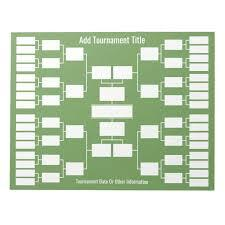
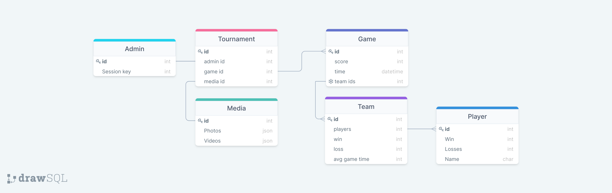

# PWP SPRING 2021
# PROJECT NAME : Pong Tournament 
# Group information
* Emil Dark, edark18@student.oulu.fi
* Markus Multamäki, markus.multamaki@student.oulu.fi
  

__Remember to include all required documentation and HOWTOs, including how to create and populate the database, how to run and test the API, the url to the entrypoint and instructions on how to setup and run the client__

Luo oma pongi turnaus napin painalluksella ja seuraa tilastoja reali ajassa muilla laitteilla. 

## Taulukko alla mainituista tulossa tulevaisuudessa:

Resources and Methods:
[ Get, Post, Put, Delete]
- tournament ID
  - admin käyttäjä
  - 
- Tiimit
  - pelaajat
  - voitot/häviöt
  - keskiverto peli aika

- Pelaajat: get, post
    -Nimi
    -voitot/häviöt
    -tiimi
    -alkoholi kulutus tournamentin aikana

- peli tietoja 
  - kesto
  - tulos
  
- Valokuvia , videoita

## Business logic:

-sekoita tiimit

-luo tournamentti kuvaaja

-näytä kuvia

-luo tournamentti koodi

## Tools
  -Python - Coding language of choice
  -Flask - Microframework for web development
  -SQLAlchemy - database toolkit

